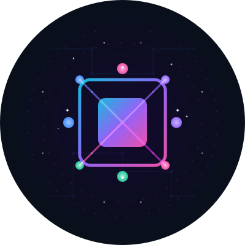

# HarmonyAI - Decentralized User Research Platform

<div align="center">
  
  <p>
    <a href="https://www.harmonyai.live/" target="_blank">Website</a> •
    <a href="https://twitter.com/_Harmony_AI" target="_blank">Twitter</a> •
    <a href="https://github.com/AIHarmony/HarmonyAI" target="_blank">GitHub</a>
  </p>
</div>

HarmonyAI is a revolutionary decentralized user research platform that seamlessly integrates advanced artificial intelligence technology with Solana's high-performance blockchain, creating an entirely new user feedback ecosystem. The platform not only transforms traditional research methods but also introduces an innovative "Contribute-to-Earn" model, providing substantial value returns to participants, while leveraging Solana's high throughput and low fee characteristics to ensure efficient and economical system operation.

## Table of Contents

- [Technical Architecture](#technical-architecture)
- [Technical Features](#technical-features)
- [Project Structure](#project-structure)
- [Main Features (MVP)](#main-features-mvp)
- [Feature Modules](#feature-modules)
- [User Flow](#user-flow)
- [Project Roadmap](#project-roadmap)
- [Project Highlights](#project-highlights)
- [Getting Started](#getting-started)
- [Solana Network Configuration](#solana-network-configuration)
- [Token Economic Model](#token-economic-model)
- [Contribution Guidelines](#contribution-guidelines)
- [Frequently Asked Questions](#frequently-asked-questions)
- [Contact Us](#contact-us)
- [License](#license)

## Technical Architecture

HarmonyAI employs a modern tech stack combining frontend, backend, AI, and blockchain technologies:

```
                                    +-----------------+
                                    |                 |
                                    |  Frontend (UI)  |
                                    |                 |
                                    +--------+--------+
                                             |
                                             v
+----------------+                 +---------+---------+                 +----------------+
|                |                 |                   |                 |                |
|  AI Services   +---------------->|  Backend Services +---------------->|  Solana Chain  |
|                |                 |                   |                 |                |
+----------------+                 +-------------------+                 +----------------+
```

### Frontend
- **Next.js**: React framework with server-side rendering
- **TypeScript**: Type-safe JavaScript
- **TailwindCSS**: Utility-first CSS framework
- **Solana Wallet Adapter**: Integration with Solana wallets

### Backend
- **Node.js**: Server-side JavaScript runtime
- **Express**: Web application framework
- **MongoDB**: NoSQL database for user data and surveys
- **Redis**: In-memory data store for caching

### AI Integration
- **OpenAI API**: For natural language processing and survey generation
- **TensorFlow.js**: Machine learning for response analysis
- **Sentiment Analysis**: For processing and analyzing user feedback

### Blockchain
- **Solana Blockchain**: High-throughput blockchain for transactions
- **Anchor Framework**: For developing Solana programs
- **Web3.js**: JavaScript API for interacting with Solana

## Technical Features

- **Multimodal AI Research Engine**: Integrating LLM, voice recognition, sentiment analysis, and computer vision technologies to create an immersive research experience
- **Blockchain Incentive Mechanism**: Rewarding high-quality research participation through HAI tokens, creating a sustainable feedback ecosystem
- **Solana Blockchain**: Utilizing the high-throughput, low-cost Solana network for reward distribution and data validation
- **DAO Governance Structure**: Community-driven platform development and decision-making mechanisms
- **Decentralized Storage**: IPFS integration for secure, distributed storage of research data
- **Zero-knowledge Proofs**: Ensuring privacy and confidentiality of sensitive research data

## Project Structure

```
/app
  /components    - React components
    /Auth        - Authentication components
    /Survey      - Survey-related components
    /Analysis    - Data analysis components
    /Wallet      - Blockchain wallet components
  /hooks         - Custom React Hooks
  /pages         - Feature pages
  /services      - API services
  /utils         - Utility functions
  /styles        - Global styles
  /lib           - Libraries and context providers
    /context     - React Context for state management
    /types       - TypeScript type definitions
/contracts       - Solana smart contracts
  /programs      - Solana programs
  /tests         - Contract tests
/public          - Static assets
```

## Main Features (MVP)

1. **Basic Account System**
   - Solana wallet connection
   - Email/password authentication
   - User profile management
   - User dashboard

2. **Research Participation**
   - Browse available research
   - Filter and search for relevant surveys
   - Participate in interactive AI research
   - Receive token rewards
   - View participation history

3. **Research Creation**
   - Create customized research
   - AI-assisted question design
   - Set reward amounts
   - Target specific demographics
   - Real-time analytics dashboard

4. **Blockchain Integration**
   - Solana transactions
   - Token reward distribution
   - Transaction record query
   - Wallet balance management

## Feature Modules

### Authentication Module
Handles user registration, login, and wallet connection with multi-factor authentication support.

### Survey Module
Core functionality for creating, managing, and participating in surveys with various question types.

### Analytics Module
Advanced data visualization and AI-powered insights generation from survey responses.

### Blockchain Module
Manages all interactions with the Solana blockchain, including transactions, token management, and smart contract calls.

### Administration Module
Tools for platform administrators to manage users, content, and system settings.

## User Flow

```
                   +-------------+
                   |             |
                   |   Landing   |
                   |             |
                   +------+------+
                          |
                          v
            +-------------+-------------+
            |                           |
  +---------+                           +--------+
  |         |                           |        |
  v         v                           v        v
+-------+ +------+               +-------+  +-------+
|       | |      |               |       |  |       |
| Login | | Sign |               | Browse|  | Create|
|       | | Up   |               | Survey|  | Survey|
+---+---+ +---+--+               +---+---+  +---+---+
    |         |                      |          |
    v         v                      v          v
+---+---------+---+             +----+----------+---+
|                 |             |                    |
|     Dashboard   |             |  Survey Details    |
|                 |             |                    |
+--------+--------+             +---------+----------+
         |                                |
         v                                v
+--------+---------+            +--------+----------+
|                  |            |                   |
| User's Surveys   |            | Take Survey       |
| & Responses      |            |                   |
|                  |            |                   |
+------------------+            +--------+----------+
                                         |
                                         v
                               +---------+---------+
                               |                   |
                               | Receive Rewards   |
                               |                   |
                               +-------------------+
```

## Project Roadmap

### Q1 2025 (Planned)
- Project ideation and preliminary research
- Technical architecture design
- MVP feature planning

### Q2 2025 (Planned)
- Development of core authentication system
- Basic survey creation and participation features
- Initial Solana wallet integration

### Q3 2025 (Planned)
- AI-assisted survey generation
- Enhanced survey analytics
- Token reward mechanism implementation

### Q4 2025 (Planned)
- Beta testing with select user groups
- Security audits and performance optimization
- UI/UX refinements based on initial feedback

### Q1 2026 (Planned)
- Public launch of the platform
- Mobile application development
- Advanced AI features implementation

### Q2 2026 (Planned)
- DAO governance structure implementation
- Integration with additional blockchains
- Enterprise features and API access

### Q3 2026 (Planned)
- Global marketing campaign
- Expansion to additional languages
- Advanced analytics and machine learning features

## Project Highlights

- **AI-Powered Research**: Unlike traditional survey platforms, HarmonyAI uses AI to help create better surveys, analyze responses more deeply, and generate actionable insights automatically.

- **Fair Compensation**: Traditional research platforms either don't pay participants or pay them very little. HarmonyAI ensures participants receive fair token rewards for their valuable input.

- **Blockchain Transparency**: All transactions and reward distributions are recorded on the Solana blockchain, ensuring complete transparency and trust.

- **Data Privacy**: Advanced encryption and optional anonymity features protect user privacy while still providing valuable research data.

- **Community Governance**: The platform is progressively decentralized, with token holders gaining voting rights on platform development and fee structures.

- **Cross-platform Support**: Access HarmonyAI on web browsers, mobile devices, and as API integrations for other applications.

## Getting Started

### Requirements

- Node.js 18 or above
- npm or yarn
- Solana CLI (optional)

### Install Dependencies

```bash
npm install
# or
yarn install
```

### Run Development Environment

```bash
npm run dev
# or
yarn dev
```

### Build Production Version

```bash
npm run build
# then
npm start
```

## Solana Network Configuration

The project currently connects to the Solana Devnet network by default. To connect to other networks, please modify the relevant configuration in the `app/components/WalletConnectionProvider.tsx` file.

```typescript
// Example: Switching to mainnet-beta
const network = "mainnet-beta"; // Change from "devnet"
```

## Token Economic Model

HAI token is the core utility token of the HarmonyAI platform, used for:

- Rewarding research participants
- Paying for research creation fees
- Governance voting rights
- Platform feature access
- Staking for premium services

### Token Distribution

- **User Rewards**: 40%
- **Platform Development**: 25%
- **Team & Advisors**: 15%
- **Community Treasury**: 10%
- **Liquidity Provision**: 10%

### Token Utility

- **Survey Creation**: Creators stake tokens to create surveys
- **Quality Incentive**: Higher rewards for higher quality responses
- **Governance**: Token holders vote on platform changes
- **Premium Features**: Access advanced features with token staking

## Contribution Guidelines

1. Fork this repository
2. Create your feature branch (`git checkout -b feature/amazing-feature`)
3. Commit your changes (`git commit -m 'Add some amazing feature'`)
4. Push to the branch (`git push origin feature/amazing-feature`)
5. Open a Pull Request

### Coding Standards

- Follow the established project structure
- Write clean, documented code with TypeScript types
- Include tests for new features
- Follow the commit message convention

## Frequently Asked Questions

### General Questions

**Q: What is HarmonyAI?**  
A: HarmonyAI is a decentralized user research platform that combines AI technology with blockchain to create a more efficient, transparent, and rewarding research ecosystem.

**Q: How is HarmonyAI different from traditional survey platforms?**  
A: HarmonyAI offers AI-assisted survey creation, fair token compensation for participants, blockchain-based transparency, and community governance.

### Participant Questions

**Q: How do I earn tokens on HarmonyAI?**  
A: You can earn HAI tokens by participating in surveys, providing quality responses, referring other users, and contributing to the community.

**Q: How are token rewards determined?**  
A: Token rewards are based on factors such as survey complexity, time required, response quality, and the creator's allocated reward pool.

### Creator Questions

**Q: How do I create a survey on HarmonyAI?**  
A: After registering and connecting your wallet, navigate to the "Create Survey" section, design your survey (with AI assistance if desired), set your reward parameters, and publish.

**Q: What types of surveys can I create?**  
A: HarmonyAI supports various survey types including multiple choice, open-ended, rating scales, and multimodal surveys with image or audio inputs.

### Technical Questions

**Q: Which wallets are supported?**  
A: HarmonyAI supports most Solana-compatible wallets including Phantom, Solflare, and Slope.

**Q: Is my data secure?**  
A: Yes, HarmonyAI employs advanced encryption, optional anonymization, and blockchain verification to ensure data security while maintaining research integrity.

## Contact Us

- **Email**: contact@harmonyai.live
- **Twitter**: @_Harmony_AI
- **GitHub**: AIHarmony/HarmonyAI

## License

This project is licensed under the MIT License - see the [LICENSE](LICENSE) file for details 